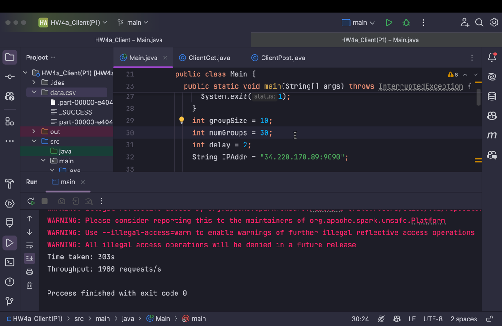
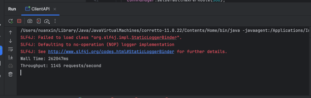
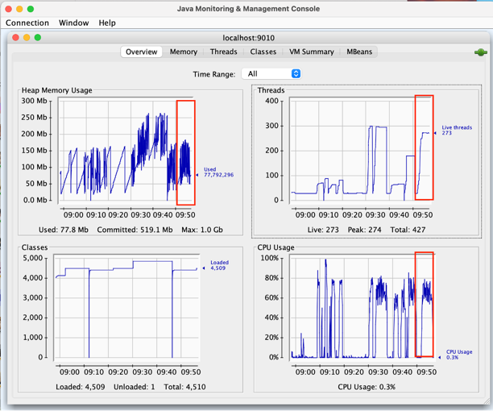
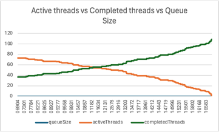
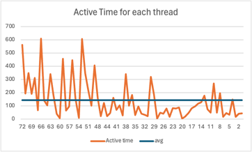
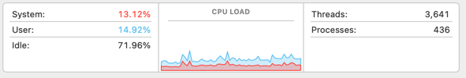
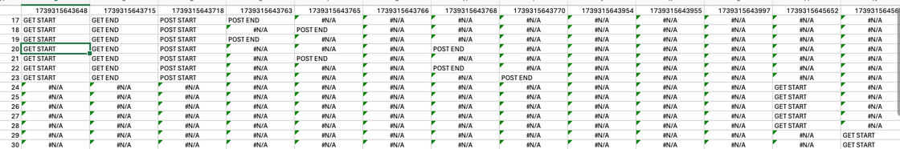

# Multithread-client-experiment
## Overview
This project demonstrates how to perform simple GET and POST requests to a server using multiple threads in Java. It uses the Apache HttpClient library for HTTP requests and Java's concurrency utilities for multithreading.

## Prerequisites
- Java Development Kit (JDK) 8 or higher
- Apache Maven
- Internet connection to download dependencies

## Setup
1. **Clone the repository:**
   ```sh
   git clone https://github.com/yourusername/multithread-client-experiment.git
   cd multithread-client-experiment
   ```
2. **Build the project using Maven:**  
   ```sh
   mvn clean install
    ```
3. **Run the project:**  
   ```sh
   cd src/main/java
   java -cp multithread-client-experiment-1.0-SNAPSHOT.jar com.example.ClientAPI
   ```

## Configuration
- Thread Group Size: The number of threads in each group. Configurable in ClientAPI.java.
- Number of Thread Groups: The number of thread groups. Configurable in ClientAPI.java.
- Delay: The delay between the start of each thread group in milliseconds. Configurable in ClientAPI.java.
- Server URLs: The URLs for the GET and POST requests. Configurable in ClientAPI.java.

## Logging
The application logs the following information for each request:  
- Timestamp 
- Thread Group 
- Number of active threads 
- Number of completed tasks 
- Queue size 
- Task count

## Results
The Runnable method outperforms the nonRunnable method by 40%. The Runnable tasks achieve a throughput of 2000 requests 
per second, whereas the nonRunnable tasks reach only 1100 requests per second. For the 99th percentile latency, the 
Runnable tasks have a latency of N seconds, while the nonRunnable tasks have a latency of N seconds.

Runnable results:



NonRunnable results:



### Performance Analysis
Based on our experiment, we explored several possible reasons for the performance discrepancy:
1. Server side Factors:
    - Limited server threads to handle high client load
    - CPU overload due to excessive requests
    - Frequent garbage collection (GC) cycles
However, JConsole monitoring shows:
    - CPU usage remains at 70%-80%
    - GC frequency is moderate
    - Active server threads are below the configured maxThread
Moreover, since both methods use the same server, we ruled out server-side bottlenecks as a cause.
    
   
2. Network Factors:
    - Potential network latency
However, network conditions remained stable, and both methods operated within the same network environment.
Thus, the network is not a limiting factor.


   
3. Client sid Factors:
   - Thread pool limitations: We increased the thread pool size to 1000 and tested a cachedThreadPool, but performance did not improve.
   - Queue delays: We monitored queue size and active threads, but the queue size remained 0, and active threads were consistently within limits.
   
   
   
   - Scheduler overhead: Removing the scheduler from the nonRunnable method did not improve performance.
   - The Runnable method is more efficient in terms of memory usage and CPU usage.
    We monitored the CPU usage and memory usage, and the CPU usage is healthy, and the memory usage is healthy as well.
   
   
   
   
   - Asynchronous execution advantage: We logged start and end times for each GET and POST request and found no significant differences in request handling—both methods processed requests synchronously.
   
   

   - Remaining Hypotheses:
     The Runnable method may still have advantages due to:
     1. Lower thread creation overhead compared to the nonRunnable method.
     2. More efficient thread closure in the Runnable method.
     3. Potential unidentified bugs affecting execution efficiency.