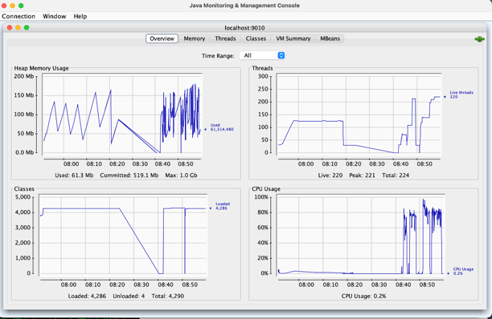

# Multithread-client-experiment
## Overview
This project demonstrates how to perform simple GET and POST requests to a server using multiple threads in Java. It uses the Apache HttpClient library for HTTP requests and Java's concurrency utilities for multithreading.

## Prerequisites
- Java Development Kit (JDK) 8 or higher
- Apache Maven
- Internet connection to download dependencies

## Setup
1. **Clone the repository:**
   ```sh
   git clone https://github.com/yourusername/multithread-client-experiment.git
   cd multithread-client-experiment
   ```
2. **Build the project using Maven:**  
   ```sh
   mvn clean install
    ```
3. **Run the project:**  
   ```sh
   cd src/main/java
   java -cp multithread-client-experiment-1.0-SNAPSHOT.jar com.example.ClientAPI
   ```

## Configuration
- Thread Group Size: The number of threads in each group. Configurable in ClientAPI.java.
- Number of Thread Groups: The number of thread groups. Configurable in ClientAPI.java.
- Delay: The delay between the start of each thread group in milliseconds. Configurable in ClientAPI.java.
- Server URLs: The URLs for the GET and POST requests. Configurable in ClientAPI.java.

## Logging
The application logs the following information for each request:  
- Timestamp 
- Thread Group 
- Number of active threads 
- Number of completed tasks 
- Queue size 
- Task count

## Results
The Runnable method outperforms the nonRunnable method by 40%. The Runnable tasks achieve a throughput of 2000 requests 
per second, whereas the nonRunnable tasks reach only 1100 requests per second. For the 99th percentile latency, the 
Runnable tasks have a latency of N seconds, while the nonRunnable tasks have a latency of N seconds.

Runnable results:


NonRunnable results:


### Performance Analysis
Based on our experiment, we explored several possible reasons for the performance discrepancy:
1. Server side Factors:
    - Limited server threads to handle high client load
    - CPU overload due to excessive requests
    - Frequent garbage collection (GC) cycles
However, JConsole monitoring shows:
    - CPU usage remains at 70%-80%
    - GC frequency is moderate
    - Active server threads are below the configured maxThread
Moreover, since both methods use the same server, we ruled out server-side bottlenecks as a cause.

   
2. Network Factors:
    - Potential network latency
However, network conditions remained stable, and both methods operated within the same network environment.
Thus, the network is not a limiting factor.


   
3. Client sid Factors:
   - The Thread Pool size in the nonRunnable method limits the number of threads that can be executed concurrently.
   We increased the size of the thread pool to 1000 and tested changed the thread pool size as cachedThreadPool, but the
    performance did not improve.

   - The nonRunnable method makes threads wait in the queue and delay the operation.
   However, we monitor the queue size and the number of active threads, and the queue size is always 0, and the number
    of active threads is always less than the thread pool size and the total number of threads is aligned with our 
   setting.
   
   
   
   - The overhead of using scheduler in nonRunnable method is expensive.
   However, we experimented with deleting scheduler in the nonRunnable method, the performance did not improve.

   - The Runnable method is more efficient in terms of memory usage and CPU usage.
    We monitored the CPU usage and memory usage, and the CPU usage is healthy, and the memory usage is healthy as well.
   
   
   
   
   - The Runnable method works each Get and Post request asynchronously, while the nonRunnable method works each Get and
    Post request synchronously.
      We document the start time and the end time of each threadID doing each get and post request. We found that they worked
      synchronously, and the thread in Runnable method does not work for the next request while waiting for the response 
      from the server.
   
   

   - The remaining assumption might be:
     1. The overhead of creating threads in Runnable method and nonRunnable method is different.
     2. The overhead of closing threads in Runnable method and nonRunnable method is different.
     3. Any bugs in code that we did not find.